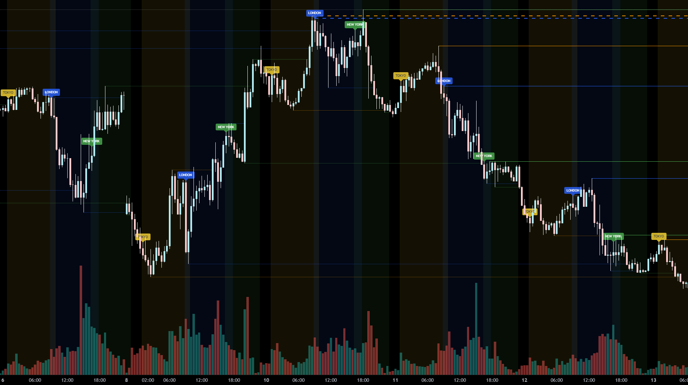

# Trading Sessions High/Low (Custom) — Pine Script v6

This repository contains a TradingView **Pine Script v6** indicator that highlights major trading sessions and draws **session High/Low levels** as horizontal lines.

It is designed to help you quickly see:
- Where each session started/ended (via background shading)
- The **High** and **Low** of the session (tracked during the session, then “locked in” after it ends)
- Whether a session level is **active**, **touched**, or **broken**, using different colors/styles
- Optional **alerts** when price breaks a previous session high/low

## Screenshot

## Sessions included

The script supports the following sessions (each can be enabled/disabled and customized):

- **Tokyo**
- **London**
- **New York**
- **Sydney**

For each session you can configure:
- Session time (e.g. `0000-0900`)
- Background color
- Whether to show a session label
- Max number of High/Low lines to keep on the chart (to avoid clutter)

## How it works (high level)

1. **Session detection**
   - Uses TradingView session inputs (`input.session(...)`) + a selectable timezone.
   - Detects when a session **starts** and **ends**.

2. **Backgrounds + labels**
   - While a session is active, it shades the background.
   - At session start, it can print a label (TOKYO / LONDON / NEW YORK / SYDNEY).

3. **Tracking High/Low during the session**
   - While a session is active, it continuously updates the current session **High** and **Low**.

4. **Creating “fixed” High/Low lines after session end**
   - When the session ends, it creates horizontal High and Low lines.
   - Lines are stored in arrays, and the script automatically removes the oldest lines once a per-session limit is reached.

5. **State changes: Active → Touched → Broken**
   - **Active:** line is still valid and being extended
   - **Touched:** price has reached the level (visual style changes)
   - **Broken:** price closes beyond the level (visual style changes + optional alert)

6. **Break alerts**
   - Optional alerts fire when price breaks a session High or Low:
     - “Break of TOKYO High …”
     - “Break of LONDON Low …” etc.

## How to use (TradingView)

1. Open TradingView → **Pine Editor**
2. Copy & paste the contents of the `Session Lines` file into the editor
3. Click **Add to chart**
4. Configure:
   - Timezone
   - Which sessions are enabled
   - Session times and styling
   - Alert settings
   - Max lines per session

## Notes / limitations

- **Performance / object limits:** This script draws many `line.new()` and `label.new()` objects.  
  If TradingView becomes slow or hits object limits, reduce the **Max Lines** settings per session and/or disable sessions you don’t need.
- **Timezone:** Make sure the selected timezone matches how you want sessions to be defined on your chart.
